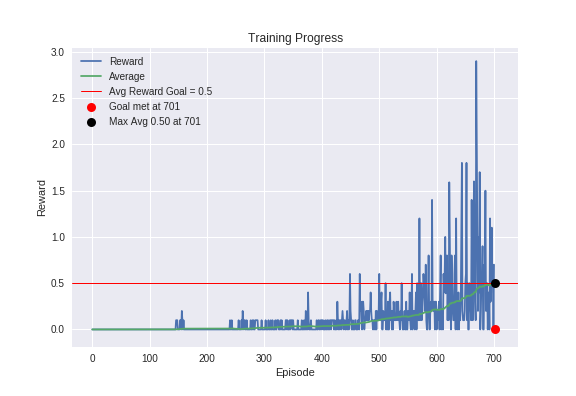
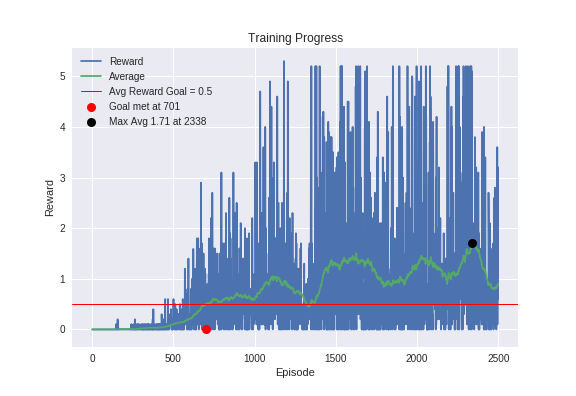
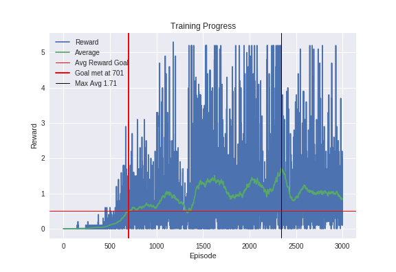
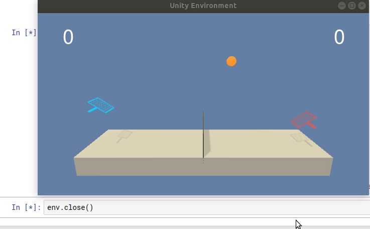

# Project 3: Collaboration and Competition

## Environment
In this environment, two agents control rackets to bounce a ball over a net. 

## Goal
The goal of each agent is to keep the ball in play.
The environment is considered solved, when the average (over 100 episodes) of those scores is at least **+0.5**.

## Other environment info
* **Reward:** +0.1 _(If an agent hits the ball over the net)_
* **Penalty:** -0.1 _(If an agent lets a ball hit the ground or hits the ball out of bounds)_
* **Possible Actions:** 2 _(Every entry in the action vector should be a number between -1 and 1.)_
* **Available States:** 24 _(The observation space consists of 8 variables corresponding to the position and velocity of the ball and racket. Two continuous actions are available, corresponding to movement toward (or away from) the net, and jumping.)_
* **Number of agents:** 2 _(Each agent receives its own, local observation)_

## Solution
The environment is solved with DDPG algorithm _([Continuous control with deep reinforcement learning - arXiv:1509.02971 [cs.LG]](https://arxiv.org/pdf/1509.02971.pdf))_


## DDPG Algorithm
Deep Deterministic Policy Gradient (DDPG) is an algorithm which builds upon the Advantage Actor-Critic algorithm.\
In DDPG, agent concurrently learns a Q-function and a policy.\
In the algorithm, we make use of the concept of REINFORCE where a reward > baseline (Average of all rewards starting from State S<sub>n</sub>) is considered a good action. As this is similar to the value function, it will help us to determine V<sub>n</sub>(S<sub>n</sub>)In DDPG, this is considered a Critic network. This critic network will be updated for every action.\
As part of the Actor network, we will be determining the Q function. Actor network will be updated based on the action.\
In DDPG, we also make use of a ReplayBuffer as in DQN. Actions will be determined based on random exploitaion from the ReplayBuffer. This will also help in avoiding the agent learning continuous sequential actions.\
We also make use of Ornstein–Uhlenbeck noise process so that the network can 'explore' the observation space for any actions. This is implemented by adding the OU Noise to action value returned from the network.\
As in the paper, we will be using Adam _([Adam: A Method for Stochastic Optimization - arXiv:1412.6980v9 [cs.LG]](https://arxiv.org/pdf/1412.6980.pdf))_ algorithm to optimize the networks.\

### Model Architecture
As per the DDPG paper, four networks were used:
    1. Actor (Local)
    2. Critic (Local)
    3. Actor (Target)
    4. Critic (Target)

Below are the structures for #1 and #3 (Actor):
```
Actor(
  (inp): Linear(in_features=33, out_features=330, bias=True)
  (h1): Linear(in_features=330, out_features=160, bias=True)
  (out): Linear(in_features=160, out_features=4, bias=True)
)
```

Below are the structures for #2 and #4 (Critic):
```
Critic(
  (inp): Linear(in_features=33, out_features=330, bias=True)
  (h1): Linear(in_features=334, out_features=160, bias=True)
  (out): Linear(in_features=160, out_features=1, bias=True)
)
```
<sub>Actions (4) were added to hidden layer as per DDPG paper</sub>

### Hyper Parameters 
Below hyper parameters were used:

```
SEED                = 0
REPLAY_BUFFER_SIZE  = 1e+6
ACTOR_LR            = 1e-4
CRITIC_LR           = 1e-3 
GAMMA               = 0.99
TAU                 = 1e-2 # DDPG Paper = 1e-3
BATCH_SIZE          = 512  # DDPG Paper = 32
WEIGHT_DECAY        = 0    # DDPG Paper = 1e-2
Hidden Network Nodes = [256, 128] # DDPG Paper = [400, 300]
```

### Training Progress
With the tuned hyper parameters, the environment was solved at the 701st episode:

`Solved in 701 episodes - Received an average score of 0.50 in last 100`

### Training Progress - Plot of Rewards


```
Target Goal: 0.5
  100/2500: Last3 = ['0.0', '0.0', '0.0'] << Last 100 Avg = 0.00, Max Avg = 0.00 >> Elapsed = 0:00:13    
  200/2500: Last3 = ['0.0', '0.0', '0.0'] << Last 100 Avg = 0.01, Max Avg = 0.01 >> Elapsed = 0:00:28    
  300/2500: Last3 = ['0.0', '0.0', '0.0'] << Last 100 Avg = 0.02, Max Avg = 0.02 >> Elapsed = 0:00:47    
  400/2500: Last3 = ['0.0', '0.1', '0.1'] << Last 100 Avg = 0.04, Max Avg = 0.04 >> Elapsed = 0:01:09    
  500/2500: Last3 = ['0.1', '0.1', '0.2'] << Last 100 Avg = 0.10, Max Avg = 0.10 >> Elapsed = 0:01:43    
  600/2500: Last3 = ['0.0', '0.3', '0.3'] << Last 100 Avg = 0.22, Max Avg = 0.22 >> Elapsed = 0:02:43    
  700/2500: Last3 = ['0.5', '0.7', '0.0'] << Last 100 Avg = 0.50, Max Avg = 0.50 >> Elapsed = 0:04:40    
  701/2500: Last3 = ['0.7', '0.0', '0.7'] << Last 100 Avg = 0.50, Max Avg = 0.50 >> Elapsed = 0:04:41    

Solved in 701 episodes - Received an average score of 0.50 in last 100

Training completed. Models saved.
```

### Attempts to go higher than the defined 0.5 goal
Using the same hyper parameters, tried to obtain a higher reward by using 2500 and 3000 episodes.
The maximum running average over 100 episodes was an impressive **+1.71**.
As the same SEED value were used, the performance was consistent across runs.

#### Attempt 1: 2500 episodes



```
Target Goal: 0.5
  100/2500: Last3 = ['0.0', '0.0', '0.0'] << Last 100 Avg = 0.00, Max Avg = 0.00 >> Elapsed = 0:00:13    
  200/2500: Last3 = ['0.0', '0.0', '0.0'] << Last 100 Avg = 0.01, Max Avg = 0.01 >> Elapsed = 0:00:29    
  300/2500: Last3 = ['0.0', '0.0', '0.0'] << Last 100 Avg = 0.02, Max Avg = 0.02 >> Elapsed = 0:00:47    
  400/2500: Last3 = ['0.0', '0.1', '0.1'] << Last 100 Avg = 0.04, Max Avg = 0.04 >> Elapsed = 0:01:07    
  500/2500: Last3 = ['0.1', '0.1', '0.2'] << Last 100 Avg = 0.10, Max Avg = 0.10 >> Elapsed = 0:01:40    
  600/2500: Last3 = ['0.0', '0.3', '0.3'] << Last 100 Avg = 0.22, Max Avg = 0.22 >> Elapsed = 0:02:37    
  700/2500: Last3 = ['0.5', '0.7', '0.0'] << Last 100 Avg = 0.50, Max Avg = 0.50 >> Elapsed = 0:04:30    
  701/2500: Last3 = ['0.7', '0.0', '0.7'] << Last 100 Avg = 0.50, Max Avg = 0.50 >> Elapsed = 0:04:32    

Solved in 701 episodes - Received an average score of 0.50 in last 100
  800/2500: Last3 = ['0.4', '0.3', '1.6'] << Last 100 Avg = 0.57, Max Avg = 0.61 >> Elapsed = 0:06:40    
  900/2500: Last3 = ['0.1', '0.5', '0.0'] << Last 100 Avg = 0.67, Max Avg = 0.72 >> Elapsed = 0:09:16    
 1000/2500: Last3 = ['0.2', '0.4', '1.1'] << Last 100 Avg = 0.60, Max Avg = 0.72 >> Elapsed = 0:11:40    
 1100/2500: Last3 = ['0.4', '0.2', '1.7'] << Last 100 Avg = 0.99, Max Avg = 0.99 >> Elapsed = 0:15:42    
 1200/2500: Last3 = ['1.3', '2.2', '0.8'] << Last 100 Avg = 0.89, Max Avg = 1.05 >> Elapsed = 0:19:31    
 1300/2500: Last3 = ['0.5', '0.0', '0.3'] << Last 100 Avg = 0.65, Max Avg = 1.05 >> Elapsed = 0:22:33    
 1400/2500: Last3 = ['0.5', '1.4', '0.0'] << Last 100 Avg = 0.74, Max Avg = 1.05 >> Elapsed = 0:26:09    
 1500/2500: Last3 = ['1.5', '0.3', '0.6'] << Last 100 Avg = 1.31, Max Avg = 1.37 >> Elapsed = 0:32:42    
 1600/2500: Last3 = ['0.3', '0.8', '2.3'] << Last 100 Avg = 1.39, Max Avg = 1.42 >> Elapsed = 0:40:14    
 1700/2500: Last3 = ['0.7', '0.3', '0.8'] << Last 100 Avg = 1.37, Max Avg = 1.51 >> Elapsed = 0:48:19    
 1800/2500: Last3 = ['3.1', '0.0', '0.2'] << Last 100 Avg = 0.86, Max Avg = 1.51 >> Elapsed = 0:53:50    
 1900/2500: Last3 = ['0.1', '0.0', '1.0'] << Last 100 Avg = 1.02, Max Avg = 1.51 >> Elapsed = 1:00:34    
 2000/2500: Last3 = ['5.2', '1.4', '3.1'] << Last 100 Avg = 1.27, Max Avg = 1.51 >> Elapsed = 1:09:20    
 2100/2500: Last3 = ['0.0', '3.5', '4.1'] << Last 100 Avg = 1.26, Max Avg = 1.51 >> Elapsed = 1:18:32    
 2200/2500: Last3 = ['0.1', '0.3', '0.5'] << Last 100 Avg = 1.04, Max Avg = 1.51 >> Elapsed = 1:26:36    
 2300/2500: Last3 = ['2.7', '2.0', '0.5'] << Last 100 Avg = 1.44, Max Avg = 1.51 >> Elapsed = 1:38:01    
 2400/2500: Last3 = ['0.8', '0.1', '1.2'] << Last 100 Avg = 1.29, Max Avg = 1.71 >> Elapsed = 1:48:55    
 2500/2500: Last3 = ['0.6', '1.5', '3.2'] << Last 100 Avg = 0.91, Max Avg = 1.71 >> Elapsed = 1:57:04    

Training completed. Models saved.
```

#### Attempt 2: 3000 episodes



```
Target Goal: 0.5
  100/3000: Last3 = ['0.0', '0.0', '0.0'] << Last 100 Avg = 0.00, Max Avg = 0.00 >> Elapsed = 0:00:12    
  200/3000: Last3 = ['0.0', '0.0', '0.0'] << Last 100 Avg = 0.01, Max Avg = 0.01 >> Elapsed = 0:00:28    
  300/3000: Last3 = ['0.0', '0.0', '0.0'] << Last 100 Avg = 0.02, Max Avg = 0.02 >> Elapsed = 0:00:45    
  400/3000: Last3 = ['0.0', '0.1', '0.1'] << Last 100 Avg = 0.04, Max Avg = 0.04 >> Elapsed = 0:01:05    
  500/3000: Last3 = ['0.1', '0.1', '0.2'] << Last 100 Avg = 0.10, Max Avg = 0.10 >> Elapsed = 0:01:37    
  600/3000: Last3 = ['0.0', '0.3', '0.3'] << Last 100 Avg = 0.22, Max Avg = 0.22 >> Elapsed = 0:02:36    
  700/3000: Last3 = ['0.5', '0.7', '0.0'] << Last 100 Avg = 0.50, Max Avg = 0.50 >> Elapsed = 0:04:33    
  701/3000: Last3 = ['0.7', '0.0', '0.7'] << Last 100 Avg = 0.50, Max Avg = 0.50 >> Elapsed = 0:04:34    

Solved in 701 episodes - Received an average score of 0.50 in last 100
  800/3000: Last3 = ['0.4', '0.3', '1.6'] << Last 100 Avg = 0.57, Max Avg = 0.61 >> Elapsed = 0:06:45    
  900/3000: Last3 = ['0.1', '0.5', '0.0'] << Last 100 Avg = 0.67, Max Avg = 0.72 >> Elapsed = 0:09:20    
 1000/3000: Last3 = ['0.2', '0.4', '1.1'] << Last 100 Avg = 0.60, Max Avg = 0.72 >> Elapsed = 0:11:43    
 1100/3000: Last3 = ['0.4', '0.2', '1.7'] << Last 100 Avg = 0.99, Max Avg = 0.99 >> Elapsed = 0:15:42    
 1200/3000: Last3 = ['1.3', '2.2', '0.8'] << Last 100 Avg = 0.89, Max Avg = 1.05 >> Elapsed = 0:19:30    
 1300/3000: Last3 = ['0.5', '0.0', '0.3'] << Last 100 Avg = 0.65, Max Avg = 1.05 >> Elapsed = 0:22:30    
 1400/3000: Last3 = ['0.5', '1.4', '0.0'] << Last 100 Avg = 0.74, Max Avg = 1.05 >> Elapsed = 0:26:04    
 1500/3000: Last3 = ['1.5', '0.3', '0.6'] << Last 100 Avg = 1.31, Max Avg = 1.37 >> Elapsed = 0:32:34    
 1600/3000: Last3 = ['0.3', '0.8', '2.3'] << Last 100 Avg = 1.39, Max Avg = 1.42 >> Elapsed = 0:40:01    
 1700/3000: Last3 = ['0.7', '0.3', '0.8'] << Last 100 Avg = 1.37, Max Avg = 1.51 >> Elapsed = 0:48:00    
 1800/3000: Last3 = ['3.1', '0.0', '0.2'] << Last 100 Avg = 0.86, Max Avg = 1.51 >> Elapsed = 0:53:29    
 1900/3000: Last3 = ['0.1', '0.0', '1.0'] << Last 100 Avg = 1.02, Max Avg = 1.51 >> Elapsed = 1:00:10    
 2000/3000: Last3 = ['5.2', '1.4', '3.1'] << Last 100 Avg = 1.27, Max Avg = 1.51 >> Elapsed = 1:08:52    
 2100/3000: Last3 = ['0.0', '3.5', '4.1'] << Last 100 Avg = 1.26, Max Avg = 1.51 >> Elapsed = 1:18:00    
 2200/3000: Last3 = ['0.1', '0.3', '0.5'] << Last 100 Avg = 1.04, Max Avg = 1.51 >> Elapsed = 1:25:59    
 2300/3000: Last3 = ['2.7', '2.0', '0.5'] << Last 100 Avg = 1.44, Max Avg = 1.51 >> Elapsed = 1:37:30    
 2400/3000: Last3 = ['0.8', '0.1', '1.2'] << Last 100 Avg = 1.29, Max Avg = 1.71 >> Elapsed = 1:48:43    
 2500/3000: Last3 = ['0.6', '1.5', '3.2'] << Last 100 Avg = 0.91, Max Avg = 1.71 >> Elapsed = 1:57:15    
 2600/3000: Last3 = ['1.4', '0.3', '1.0'] << Last 100 Avg = 1.19, Max Avg = 1.71 >> Elapsed = 2:08:39    
 2700/3000: Last3 = ['0.2', '2.4', '0.3'] << Last 100 Avg = 1.00, Max Avg = 1.71 >> Elapsed = 2:18:28    
 2800/3000: Last3 = ['0.5', '2.5', '0.7'] << Last 100 Avg = 1.01, Max Avg = 1.71 >> Elapsed = 2:28:36    
 2900/3000: Last3 = ['0.2', '0.9', '0.3'] << Last 100 Avg = 1.03, Max Avg = 1.71 >> Elapsed = 2:39:31    
 3000/3000: Last3 = ['2.0', '0.1', '0.5'] << Last 100 Avg = 0.85, Max Avg = 1.71 >> Elapsed = 2:49:08    

Training completed. Models saved.
```

### Checkpoints
After every 100 steps, model weights were saved to corresponding files for all four networks.
Checkpoint was also saved at the end of training. This final version of checkpoint file can be used for inspecting the agent performance.

### Agent in action - Loaded from checkpoints


`Ball was bounced for a total of 52 times by both players.`

### Hyper Parameter Tuning
As you may notice, some of the hyper parameters were modified from the original DDPG paper. 
This was due to the very low performance observed with values shared in the original paper.
Please see below for more information

#### Hyper Params from Paper

```
REPLAY_BUFFER_SIZE   = 1e+6
ACTOR_LR             = 1e-4
CRITIC_LR            = 1e-3
GAMMA                = 0.99
TAU                  = 1e-3
BATCH_SIZE           = 32
WEIGHT_DECAY         = 1e-2
Hidden Network Nodes = [400, 300]
```
#### Hyper Params from Paper - Training Progress
The training didnt yeild any learning even after _2500_ episodes.

```
Target Goal: 0.5
  100/2500: Last3 = ['0.0', '0.0', '0.0'] << Last 100 Avg = 0.00, Max Avg = 0.00 >> Elapsed = 0:00:10    
  200/2500: Last3 = ['0.0', '0.0', '0.0'] << Last 100 Avg = 0.00, Max Avg = 0.00 >> Elapsed = 0:00:20    
  300/2500: Last3 = ['0.0', '0.0', '0.0'] << Last 100 Avg = 0.00, Max Avg = 0.00 >> Elapsed = 0:00:30    
  400/2500: Last3 = ['0.0', '0.0', '0.0'] << Last 100 Avg = 0.00, Max Avg = 0.00 >> Elapsed = 0:00:39    
  500/2500: Last3 = ['0.0', '0.0', '0.0'] << Last 100 Avg = 0.00, Max Avg = 0.00 >> Elapsed = 0:00:49    
  600/2500: Last3 = ['0.0', '0.0', '0.0'] << Last 100 Avg = 0.00, Max Avg = 0.00 >> Elapsed = 0:00:59    
  700/2500: Last3 = ['0.0', '0.0', '0.0'] << Last 100 Avg = 0.00, Max Avg = 0.00 >> Elapsed = 0:01:08    
  800/2500: Last3 = ['0.0', '0.0', '0.0'] << Last 100 Avg = 0.00, Max Avg = 0.00 >> Elapsed = 0:01:18    
  900/2500: Last3 = ['0.0', '0.0', '0.0'] << Last 100 Avg = 0.00, Max Avg = 0.00 >> Elapsed = 0:01:27    
 1000/2500: Last3 = ['0.0', '0.0', '0.0'] << Last 100 Avg = 0.00, Max Avg = 0.00 >> Elapsed = 0:01:37    
 1100/2500: Last3 = ['0.0', '0.0', '0.0'] << Last 100 Avg = 0.00, Max Avg = 0.00 >> Elapsed = 0:01:47    
 1200/2500: Last3 = ['0.0', '0.0', '0.0'] << Last 100 Avg = 0.00, Max Avg = 0.00 >> Elapsed = 0:01:56    
 1300/2500: Last3 = ['0.0', '0.0', '0.0'] << Last 100 Avg = 0.00, Max Avg = 0.00 >> Elapsed = 0:02:06    
 1400/2500: Last3 = ['0.0', '0.0', '0.0'] << Last 100 Avg = 0.00, Max Avg = 0.00 >> Elapsed = 0:02:16    
 1500/2500: Last3 = ['0.0', '0.0', '0.0'] << Last 100 Avg = 0.00, Max Avg = 0.00 >> Elapsed = 0:02:25    
 1600/2500: Last3 = ['0.0', '0.0', '0.0'] << Last 100 Avg = 0.00, Max Avg = 0.00 >> Elapsed = 0:02:35    
 1700/2500: Last3 = ['0.0', '0.0', '0.0'] << Last 100 Avg = 0.00, Max Avg = 0.00 >> Elapsed = 0:02:45    
 1800/2500: Last3 = ['0.0', '0.0', '0.0'] << Last 100 Avg = 0.00, Max Avg = 0.00 >> Elapsed = 0:02:55    
 1900/2500: Last3 = ['0.0', '0.0', '0.0'] << Last 100 Avg = 0.00, Max Avg = 0.00 >> Elapsed = 0:03:04    
 2000/2500: Last3 = ['0.0', '0.0', '0.0'] << Last 100 Avg = 0.00, Max Avg = 0.00 >> Elapsed = 0:03:14    
 2100/2500: Last3 = ['0.0', '0.0', '0.0'] << Last 100 Avg = 0.00, Max Avg = 0.00 >> Elapsed = 0:03:24    
 2200/2500: Last3 = ['0.0', '0.0', '0.0'] << Last 100 Avg = 0.00, Max Avg = 0.00 >> Elapsed = 0:03:33    
 2300/2500: Last3 = ['0.0', '0.0', '0.0'] << Last 100 Avg = 0.00, Max Avg = 0.00 >> Elapsed = 0:03:43    
 2400/2500: Last3 = ['0.0', '0.0', '0.0'] << Last 100 Avg = 0.00, Max Avg = 0.00 >> Elapsed = 0:03:53    
 2500/2500: Last3 = ['0.0', '0.0', '0.0'] << Last 100 Avg = 0.00, Max Avg = 0.00 >> Elapsed = 0:04:02    

Training completed. Models saved.
```

### Ideas for Future Work
* Further Hyper parameter tuning may yeild faster training time.
* DDPG Paper has references to batch normalization, it is not implemented in full in current model
* Current attempt at implementing MADDPG was not successful possibly due to parameter tuning. By using a tool to analyze and tune hyperparameters may help to use MADDPG.
* Other RL algorithms such as PPO, A3C, etc. could be used for solving the problem

